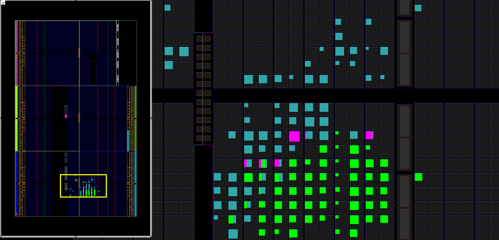

# Verilog Probe

A simple probe which takes commands & data over a simple interface and allows
software based control of an AXI bus and some general purpose registers.

---

## Implementation Details

All implementation stats are taken from the default Xilinx Vivado 2016.4
build flow, targeting an Artix-7 FPGA at speed grade `-3`.

Stat                       | Value
---------------------------|---------------------------------------------
 Flip-Flops                | 87  
 Latches                   | 0
 LUTs                      | 187
 Timing slack @ 100MHz     | 3.77ns

