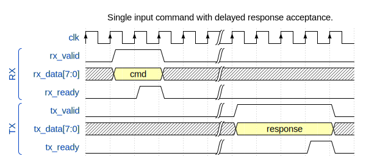

# Module Integration

This page describes how to integrate the uartprobe module into a project.

---

## Port List

This port listing is taken from the `src/hdl/uartprobe.v` verilog file.

### Clocking and Reset

 Name          | Width| Direction | Notes
---------------|------|-----------|------------------------------------------
`clk`          |      | input     | Module clock. Expects 100MHz
`m_aresetn`    |      | input     | Module asynchronous active low reset.

### Command Interface

 Name          | Width| Direction | Notes
---------------|------|-----------|------------------------------------------
`rx_valid`     |      | input     | Input command & data valid.
`rx_data`      |  7:0 | input     | Input command data.
`rx_ready`     |      | output    | Input command recieved.
`tx_valid`     |      | output    | Output data valid.
`tx_data`      |  7:0 | output    | Output data.
`tx_ready`     |      | input     | Output data recieved.

### General Purpose IO

 Name          | Width| Direction | Notes
---------------|------|-----------|------------------------------------------
`gpo`          | 31:0 | output    | Output signals. Synchronous to `clk`.
`gpi`          | 31:0 | input     | Inputs. Synchronous to `clk`.

### AXI4 Master

All AXI4 interface signals are synchronised to the module `clk` signal. The
`m_aresetn` signal acts as the AXI reset signal.

 Name          | Width| Direction | Notes
---------------|------|-----------|------------------------------------------
`m_axi_araddr` | 31:0 | output    |
`m_axi_arready`|      | input     |
`m_axi_arsize` |  2:0 | output    |
`m_axi_arvalid`|      | output    |
`m_axi_awaddr` | 31:0 | output    |
`m_axi_awready`|      | input     |
`m_axi_awsize` |  2:0 | output    |
`m_axi_awvalid`|      | output    |
`m_axi_bready` |      | output    |
`m_axi_bresp`  |  1:0 | input     |
`m_axi_bvalid` |      | input     |
`m_axi_rdata`  | 31:0 | input     |
`m_axi_rready` |      | output    |
`m_axi_rresp`  |  1:0 | input     |
`m_axi_rvalid` |      | input     |
`m_axi_wdata`  | 31:0 | output    |
`m_axi_wready` |      | input     |
`m_axi_wstrb`  |  3:0 | output    |
`m_axi_wvalid` |      | output    |

## Transaction Examples

The example transactions below show the Command Interface from the point of
view of the probe module. That is, RX means the probe module is recieving
data, and TX means it is responding with data. The probe never sends anything
without having first recieved a command.

### Simple Command-Response

### Simple Command With Write Data & No Response

Note that there is no requirement for the data to immediately follow the
command.

### Stalled Command-Response

